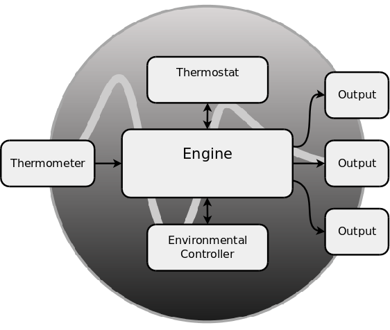

.. _components:

Components
==========
*Braubuddy* brings together a number of components to control and monitor temperature.

A growing list of :ref:`thermometers <thermometer>`, :ref:`environmental controllers <envcontroller>`, :ref:`thermostats <thermostat>` and :ref:`outputs <output>` are supported.

Consult the :ref:`contribution guidelines <contribute>` if you'd like to request or contribute support for a particular component.

.. _thermometer:

Thermometer
-----------
.. autoclass:: braubuddy.thermometer.base.IThermometer

.. _autothermometer:

Auto
^^^^
.. autoclass:: braubuddy.thermometer.auto.AutoThermometer

TEMPer USB
^^^^^^^^^^
.. autoclass:: braubuddy.thermometer.temper_usb.TEMPerThermometer

DS18B20 GPIO
^^^^^^^^^^^^
.. autoclass:: braubuddy.thermometer.ds18b20_gpio.DS18B20Thermometer

.. _envcontroller:

----

EnvController
-------------

.. _autoenvcontroller:

Auto
^^^^
.. autoclass:: braubuddy.envcontroller.auto.AutoEnvController

Tosr0x USB
^^^^^^^^^^
.. autoclass:: braubuddy.envcontroller.tosr0x_usb.Tosr0xEnvController

----

.. _thermostat:

Thermostat
----------

.. _simplerangedthermostat:

SimpleRanged
^^^^^^^^^^^^
.. autoclass:: braubuddy.thermostat.simpleranged.SimpleRangedThermostat

.. _output:

----

Output
------

.. _textfile:

TextFile
^^^^^^^^
.. autoclass:: braubuddy.output.textfile.TextFileOutput

.. _csvfile:

CSVFile
^^^^^^^
.. autoclass:: braubuddy.output.csvfile.CSVFileOutput

.. _jsonfile:

JSONFile
^^^^^^^^
.. autoclass:: braubuddy.output.jsonfile.JSONFileOutput

.. _graphiteapi:

GraphiteAPI
^^^^^^^^^^^^^^^
.. autoclass:: braubuddy.output.graphiteapi.GraphiteAPIOutput

.. _libratoapi:

LibratoAPI
^^^^^^^^^^^^^^^
.. autoclass:: braubuddy.output.libratoapi.LibratoAPIOutput

.. _listmemory:

ListMemory
^^^^^^^^^^
.. autoclass:: braubuddy.output.listmemory.ListMemoryOutput
