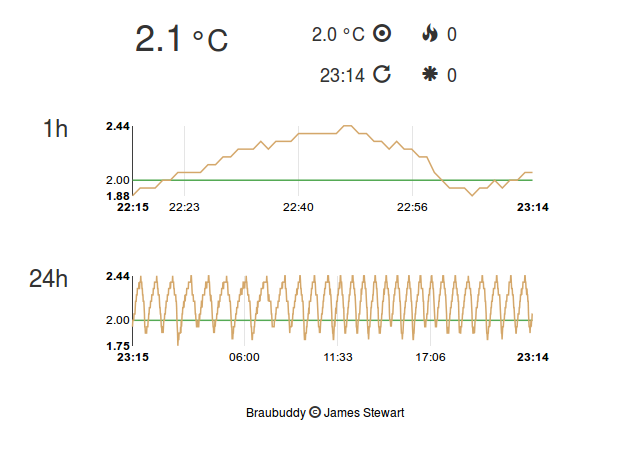

Introduction
============

*Braubuddy* is a temperature management framework written in Python.

Conceived as a means of monitoring and controlling the fermentation temperature of beer, *Braubuddy* can be used in any situation requiring precise temperature control:

- Keep tropical fish swimming happily in water that's 26°C 
- Brew a perfect lager by fermenting at a constant 9°C
- Maximise employee productivity with an optimum office ambient air temp of 21.5°C

Background
----------

Dedicated temperature management devices suffer various limitations:

* Thermostat algorithms often can not be customised.
* Adjusting settings and monitoring temperature readings require physical access.
* Output is limited to a simple digital display and no historical data is retained.
* Heater/cooler control is limited to switching mains power on/off.
* Changes to target temperature cannot be scheduled.
* Fully-featured units can be expensive.

*Braubuddy* avoids these limitations by implementing temperature management in software. A modular, extensible design allows *Braubuddy* to interface with any Thermometer or Environmental Controller hardware which enjoys Python support. 

Features
--------

Web Interface
^^^^^^^^^^^^^

*Braubuddy*'s web interface facilitates temperature monitoring from any device with a web browser:

API
^^^

Time-series temperature, heating and cooling metrics may be consumed programatically using the *Braubuddy* :ref:`API`.

Outputs
^^^^^^^

*Braubuddy* :ref:`outputs <output>` allow metric values to be recorded in a variety of formats or published directly to external services.

Extensible
^^^^^^^^^^

The various *Braubuddy* :ref:`components <components>` are designed to be extended. Consult the :ref:`contribution guidelines <contribute>` if you'd like to request or contribute support for a particular component.
